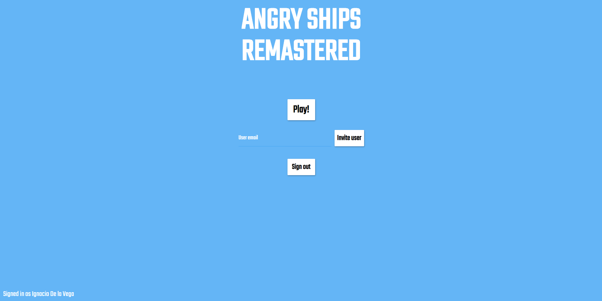
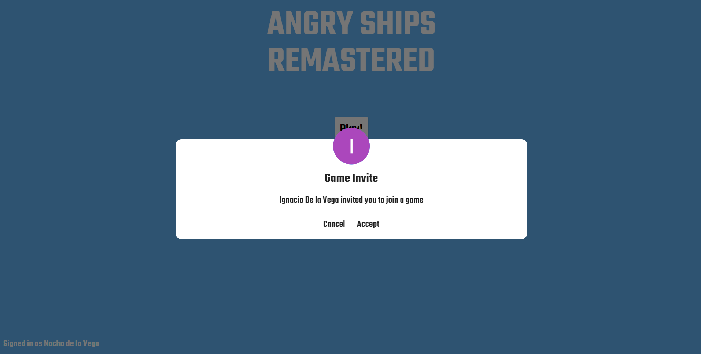
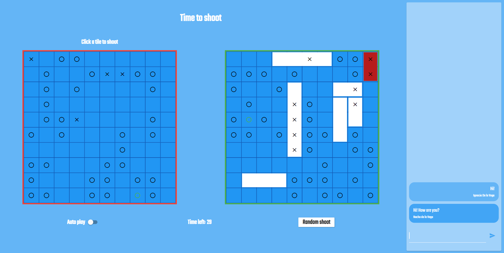

# Angry Ships Remastered

 Multiplayer browser game where you need to place your boats strategically and sunk the enemy boats. It was inspired by the board game Battleship.

The player needs to place their boats in the board and then try to guess where his opponent placed theirs. Once all the boats from any of the players are sunken the game ends.

The game was made for a lecture from the Austral University. It uses websockets for the communication between the client and the server. The frontend was made with **Flutter** and the backend was made with **Node ts**.

### Try it [**here!**](http://angry-ships-remastered.ignaciodelavega.com/)

## Screenshots

